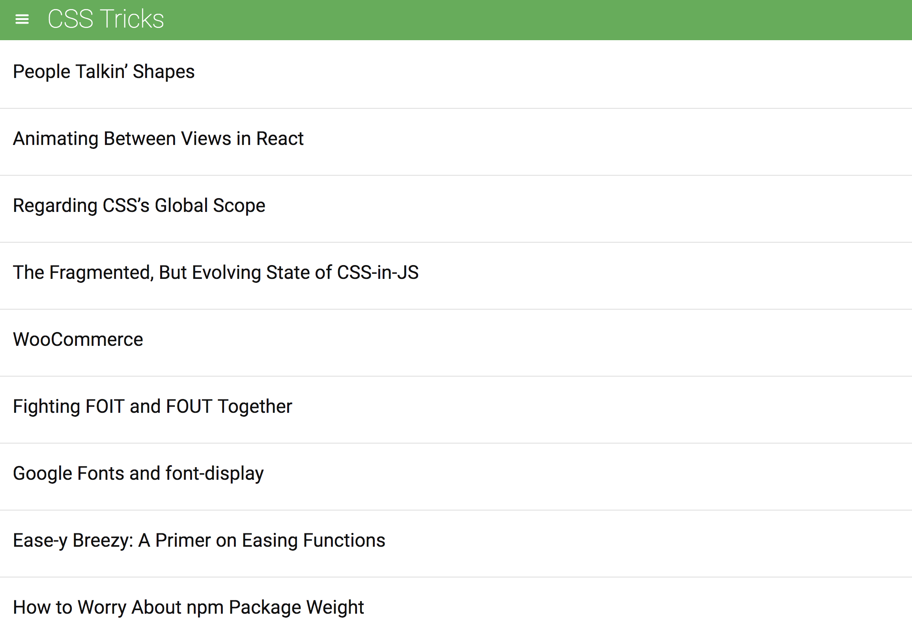
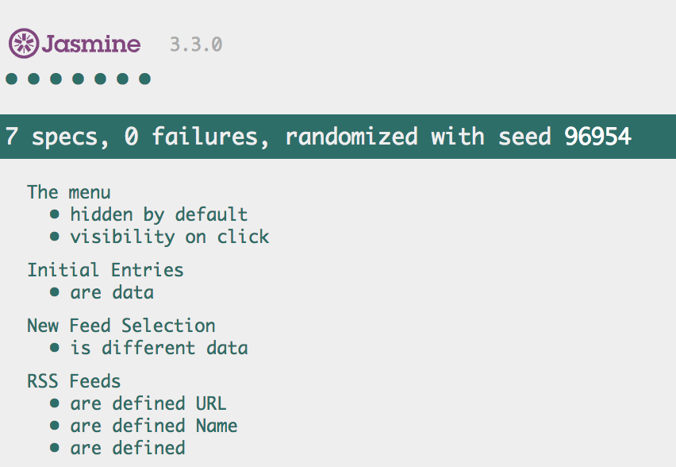

# Project Overview

In this project you are given a web-based application that reads RSS feeds. The original developer of this application clearly saw the value in testing, they've already included [Jasmine](http://jasmine.github.io/) and even started writing their first test suite!

# Run

To see the tests, open the file `index.html` in your favorite browser. You'll see somethings like this:

